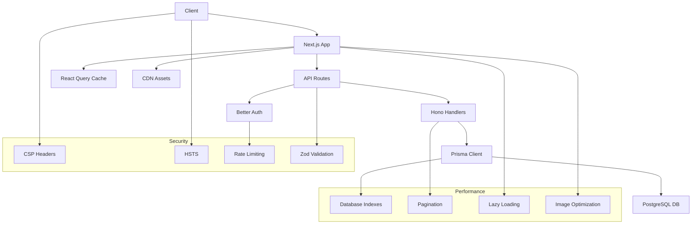

# Security, Performance, and Speed Improvements Plan for Puzzle Place

## Overview
This plan outlines comprehensive improvements to enhance security, performance, and speed for the Puzzle Place application.

## Current State Analysis
- **Security**: Basic headers in next.config, Better Auth with rate limiting, Zod validation
- **Database**: Some indexes present, but missing key ones for performance
- **API**: No pagination, basic caching via React Query
- **Frontend**: No lazy loading, standard Next.js optimizations

## Detailed Implementation Plan

### 1. Security Enhancements
- **Content Security Policy (CSP)**: Add strict CSP header to prevent XSS
- **HTTP Strict Transport Security (HSTS)**: Enforce HTTPS connections
- **Environment Validation**: Validate all env vars on startup
- **CSRF Protection**: Add tokens to sensitive forms

### 2. Database Optimizations
- **Indexes**:
  - GameEvent: CreatorUserID, IsActive, CreatedAt
  - EventPrizePool: EventID
  - GameHistory: EventID, PlayerUserID
- **Query Optimization**: Use select fields to fetch only needed data

### 3. API Performance Improvements
- **Pagination**: Implement limit/offset for game events list
- **Caching Headers**: Add appropriate cache-control headers
- **Response Optimization**: Compress responses, minimize payload

### 4. Frontend Performance Improvements
- **Lazy Loading**: Implement for page components
- **Code Splitting**: Dynamic imports for heavy components
- **Preloading**: Critical routes preloaded
- **Image Optimization**: Cloudinary transformations

### 5. Additional Optimizations
- **CDN Configuration**: For static assets
- **Monitoring**: Performance metrics and logging

## Architecture Diagram

## Implementation Priority
1. Database indexes (immediate impact)
2. Security headers (critical for production)
3. API pagination (scales with data)
4. Frontend optimizations (user experience)
5. Monitoring (ongoing)

## Metrics to Track
- Page load times
- API response times
- Database query performance
- Bundle size
- Security audit results